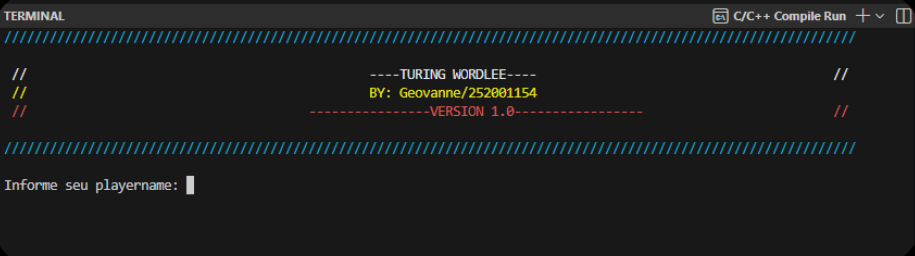
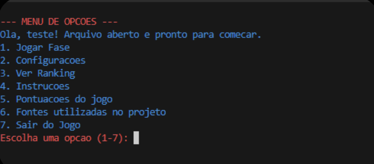
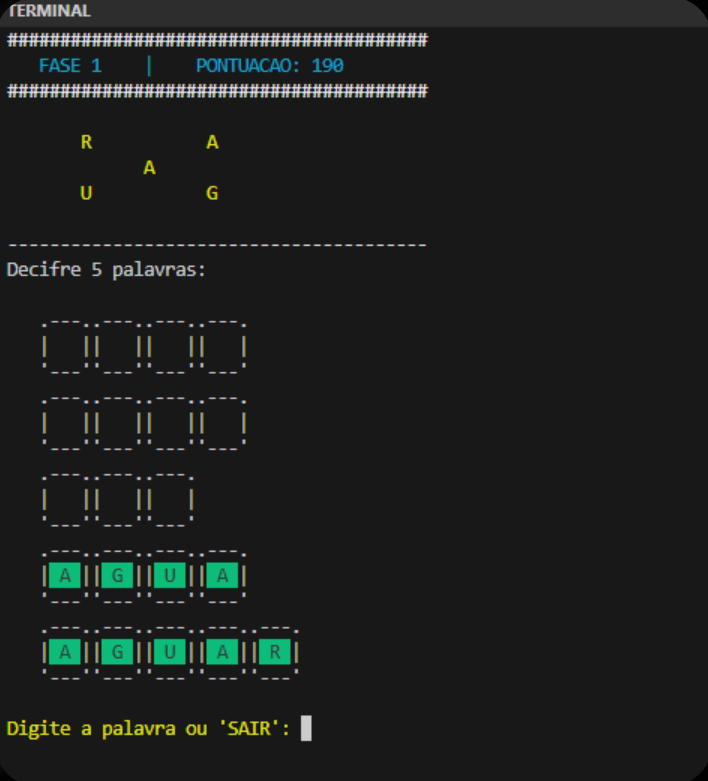
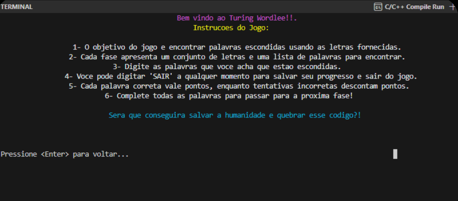
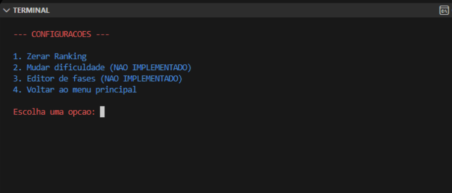

# 🔠 Turing Wordlee | Linguagem C

Este é um jogo de quebra-cabeça de palavras desenvolvido em **Linguagem C** como projeto final da disciplina de Algoritmos e Programação de Computadores (APC) na **Universidade de Brasília (UnB)**.

<div align="center">
  
</div>

## 🎮 Sobre o Projeto
O **Turing Wordlee** desafia o jogador a encontrar palavras ocultas a partir de um conjunto de letras. O projeto destaca-se pelo uso de **ASCII Art**, cores dinâmicas no terminal e um sistema completo de progressão e ranking.

---

## 🖼️ Galeria / Gallery

|  |  |
| :---: | :---: |
| 📋 **Menu de Opções** | ⌨️ **Interface de Jogo** |
|  |  |
| 📖 **Manual de Instruções** | ⚙️ **Painel de Configurações** |

---

## 🏆 Sistema de Pontuação / Scoring System

| Ação / Action | Pontuação / Score |
| :--- | :---: |
| ✅ Acertar uma palavra nova | **+100 pts** |
| 🔁 Tentar palavra já encontrada | **-10 pts** |
| ❌ Errar a palavra | **-20 pts** |
| 🏁 Concluir a fase | **+25 pts** |

---

## ✨ Destaques Técnicos
* **Persistência de Dados:** Carregamento dinâmico de níveis via `fase.txt` e armazenamento de recordes em arquivo binário `ranking.bin`.
* **Algoritmos de Ordenação:** Implementação do algoritmo **Bubble Sort** para gerar o Hall da Fama (Ranking) em tempo real.
* **Interface Visual:** Uso de sequências de escape ANSI para renderização de cores e molduras personalizadas no terminal.
* **Robustez:** Tratamento de strings para garantir que o jogo não diferencie letras maiúsculas de minúsculas.

---

## 📂 Estrutura do Repositório
* **`/src`**: Código-fonte principal (`252001154.c`).
* **`/docs`**: Documentação e manuais do projeto.
* **`/screenshots`**: Registros visuais da interface do jogo.

---

## 🚀 Como Executar
1. Certifique-se de que o arquivo `fase.txt` está na mesma pasta do executável.
2. Compile o código usando GCC:
   ```bash
   gcc src/252001154.c -o turing_wordlee
